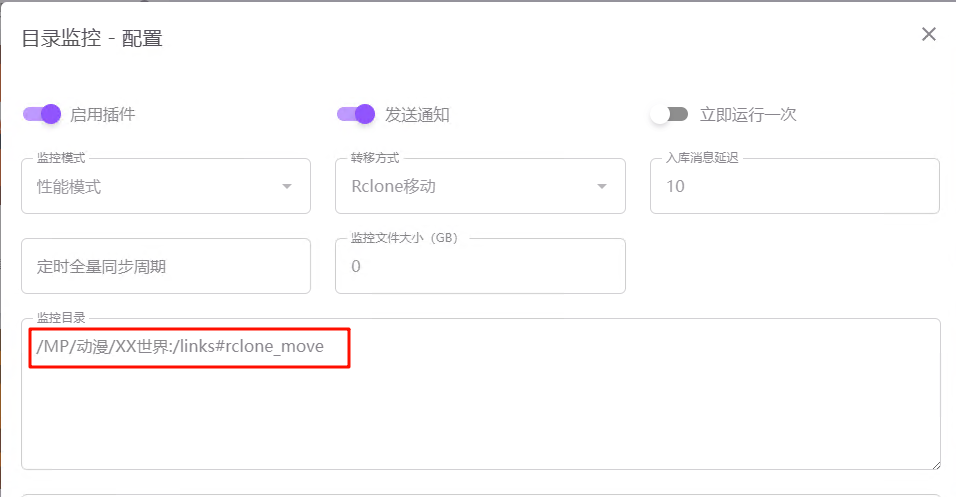

# MoviePilot

基于 [MoviePilot](https://github.com/jxxghp/MoviePilot) 出于研究目的修改。

# 仅用于学习交流使用，请勿在任何国内平台宣传该项目！

## 修改项：目录监控插件支持通过 rclone 直接基于云盘做 copy 及 move 操作 ，实现秒入库。
（原先的 rclone 貌似会在本地和云盘之间传输，非常慢，也可能我用的不对🤣）

## 使用说明（MoviePilot 基于某晖使用 docker-compose.yml 安装，仅供参考）：
### 准备工作：
1. 本地 rclone 安装并配置好，名字必须为 “MP”
2. 映射 rclone 本地挂载目录到容器，映射目录必须为 “/MP” ：
   ` - /volume2/xxx/webdav/alist/aliyun_mp:/MP `
4. 映射 rclone 配置文件目录到容器
   ` - /root/.config/rclone:/moviepilot/.config/rclone `
4. 设置 MOVIEPILOT_AUTO_UPDATE=false 避免重启时自动升级导致Patch被覆盖

### 替换相关文件:
1. 拷贝patch文件到某个容器映射目录
  ` copy {file} {Nas}/docker/moviepilot/config/mypatch `
2. ssh 登录，并进容器命令行
  ` docker exec -it moviepilot /bin/bash `
3. 拷贝1中的文件进行覆盖（建议先备份）
   ``` 
   cp /config/mypatch/MoviePilot/app/utils/system.py /app/app/utils/system.py
   cp /config/mypatch/MoviePilot/app/modules/filetransfer/__init__.py /app/app/modules/filetransfer/__init__.py
   cp /config/mypatch/MoviePilot/app/modules/themoviedb/__init__.py /app/app/modules/themoviedb/__init__.py
   cp /config/mypatch/MoviePilot-Plugins/plugins/dirmonitor/__init__.py /app/app/plugins/dirmonitor/__init__.py 
   ```
4. 可检查文件是否拷贝成功
 ` ls /app/app/utils/system.py -al ` 
  看修改时间是刚刚的就行：
 ` -rw-r--r-- 1 root root 15099 Apr 12 15:16 /app/app/utils/system.py ` 

5. 退出容器命令行，重启 moviepilot
  ` exit `
  ` docker-compose restart `

6. 配置目录监控插件
   
  前面已经映射网盘本地挂载路径到容器的 /MP 目录，这里按以下格式配置即可：
  ` /MP/动漫/XX世界:/links#rclone_move ` 
   表示将会以 rclone_move 的方式，转移 “/MP/动漫/XX世界” 中的媒体到 “/MP/links” 下面（对应 rclone 的路径则是：转移 “MP:/动漫/XX世界” 中的媒体到 “MP:/links” 下面）

    **注意**：网盘中文件命名需遵循命名规则，要能被 MoviePilot 识别出相关信息，如： XXX传.S01E095.mkv （推荐使用 ReNamer 等工具基于网盘本地挂载路径进行批量重命名操作）

    目录监控启动后，日志示例如下：
```
 INFO】2024-XX-XX  HH:13:08,590 - chain - 发送消息：channel=None，title=XX世界 (2021) S01 E155、E157-E158 已入库, text=评分：8.3，类型：电视剧，类别：国漫，共3个文件，大小：2.77G，userid=None
..............
【INFO】2024-XX-XX  HH:12:31,482 - themoviedb - /MP/links/国漫/XX世界 (2021)/Season 1/XX世界 - S01E155 - 第 155 集.mp4 刮削完成
【INFO】2024-XX-XX  HH:12:31,480 - scraper.py - 图片已保存：/MP/links/国漫/XX世界 (2021)/Season 1/XX世界 - S01E155 - 第 155 集-thumb.jpg
【INFO】2024-XX-XX  HH:12:29,889 - scraper.py - 正在下载XX世界 - S01E155 - 第 155 集-thumb图片：https://image.tmdb.org/t/p/original/l1y24HnuMi8mhzBN4SSPPhSsCfx.jpg ...
【INFO】2024-XX-XX  HH:12:29,888 - scraper.py - NFO文件已保存：/MP/links/国漫/XX世界 (2021)/Season 1/XX世界 - S01E155 - 第 155 集.nfo
【INFO】2024-XX-XX  HH:12:29,388 - scraper.py - 正在生成剧集NFO文件：XX世界 - S01E155 - 第 155 集.mp4
【INFO】2024-XX-XX  HH:12:29,386 - scraper.py - 图片已保存：/MP/links/国漫/XX世界 (2021)/season01-poster.jpg
【INFO】2024-XX-XX  HH:12:27,837 - scraper.py - 正在下载season01-poster图片：https://image.tmdb.org/t/p/original/hk6HURVTTjUmJVALgYFma7lg47B.jpg ...
【INFO】2024-XX-XX  HH:12:27,836 - scraper.py - NFO文件已保存：/MP/links/国漫/XX世界 (2021)/Season 1/season.nfo
【INFO】2024-XX-XX  HH:12:27,380 - scraper.py - 正在生成季NFO文件：Season 1
【INFO】2024-XX-XX  HH:12:27,377 - tmdbapi.py - 正在查询TMDB电视剧：[XX世界的TMDB]，季：1 ...
【INFO】2024-XX-XX  HH:12:27,376 - scraper.py - 图片已保存：/MP/links/国漫/XX世界 (2021)/banner.jpg
【INFO】2024-XX-XX  HH:12:25,352 - scraper.py - 正在下载banner图片：https://assets.fanart.tv/fanart/tv/xxxxxxx/tvbanner/perfect-world-64f0276db554b.jpg ...
【INFO】2024-XX-XX  HH:12:25,350 - scraper.py - 图片已保存：/MP/links/国漫/XX世界 (2021)/background.jpg
【INFO】2024-XX-XX  HH:12:08,697 - scraper.py - 正在下载background图片：https://assets.fanart.tv/fanart/tv/xxxxxxx/showbackground/perfect-world-64f0274d7d913.jpg ...
【INFO】2024-XX-XX  HH:12:08,695 - scraper.py - 图片已保存：/MP/links/国漫/XX世界 (2021)/thumb.jpg
【INFO】2024-XX-XX  HH:12:06,660 - scraper.py - 正在下载thumb图片：https://assets.fanart.tv/fanart/tv/xxxxxxx/tvthumb/perfect-world-64f02737eb7d7.jpg ...
【INFO】2024-XX-XX  HH:12:06,658 - scraper.py - 图片已保存：/MP/links/国漫/XX世界 (2021)/logo.png
【INFO】2024-XX-XX  HH:12:04,711 - scraper.py - 正在下载logo图片：https://assets.fanart.tv/fanart/tv/xxxxxxx/hdtvlogo/perfect-world-64ef18c05ccee.png ...
【INFO】2024-XX-XX  HH:12:04,709 - scraper.py - 图片已保存：/MP/links/国漫/XX世界 (2021)/poster.jpg
【INFO】2024-XX-XX  HH:12:03,011 - scraper.py - 正在下载poster图片：https://image.tmdb.org/t/p/original/3dEfwVZenAXUzuCltmKtq73VjtU.jpg ...
【INFO】2024-XX-XX  HH:12:03,009 - scraper.py - 图片已保存：/MP/links/国漫/XX世界 (2021)/backdrop.jpg
【INFO】2024-XX-XX  HH:12:01,438 - scraper.py - 正在下载backdrop图片：https://image.tmdb.org/t/p/original/4FLCIK7ZXN114OyBifLrBKKovwe.jpg ...
【INFO】2024-XX-XX  HH:12:01,437 - scraper.py - NFO文件已保存：/MP/links/国漫/XX世界 (2021)/tvshow.nfo
【INFO】2024-XX-XX  HH:12:00,859 - scraper.py - 正在生成电视剧NFO文件：XX世界 (2021)
【INFO】2024-XX-XX  HH:12:00,858 - themoviedb - 开始刮削媒体库文件：/MP/links/国漫/XX世界 (2021)/Season 1/XX世界 - S01E155 - 第 155 集.mp4 ...
【INFO】2024-XX-XX  HH:12:00,822 - dirmonitor - 源路径识别为云盘目录. 替换目标路径为本地映射路径：/MP/links/国漫/XX世界 (2021)/Season 1/XX世界 - S01E155 - 第 155 集.mp4
【INFO】2024-XX-XX  HH:12:00,791 - filetransfer - 文件 /MP/动漫/XX世界/XX世界.2021.S01E155.mp4 转移成功
【INFO】2024-XX-XX  HH:12:00,784 - filetransfer - 文件 /MP/动漫/XX世界/XX世界.2021.S01E155.mp4 rclone_move完成
【INFO】2024-XX-XX  HH:11:59,230 - filetransfer - 正在转移文件：/MP/动漫/XX世界/XX世界.2021.S01E155.mp4 到 /links/国漫/XX世界 (2021)/Season 1/XX世界 - S01E155 - 第 155 集.mp4
【INFO】2024-XX-XX  HH:11:59,226 - filetransfer - 获取转移目标路径：/links/国漫
【INFO】2024-XX-XX  HH:11:58,508 - tmdbapi.py - 正在查询TMDB电视剧：[XX世界的TMDB]，季：1 ...
【INFO】2024-XX-XX  HH:11:57,718 - dirmonitor - XX世界.2021.S01E155.mp4 识别为：电视剧 XX世界 (2021)
【INFO】2024-XX-XX  HH:11:57,533 - themoviedb - XX世界 TMDB识别结果：电视剧 XX世界 (2021) [XX世界的TMDB]
【INFO】2024-XX-XX  HH:11:57,532 - tmdbapi.py - [XX世界的TMDB] 查询结果：XX世界
【INFO】2024-XX-XX  HH:11:56,950 - tmdbapi.py - 正在查询TMDB电视剧：[XX世界的TMDB] ...
【INFO】2024-XX-XX  HH:11:56,949 - themoviedb - XX世界 使用TMDB识别缓存：XX世界
【INFO】2024-XX-XX  HH:11:56,937 - dirmonitor - 开始全量同步监控目录 ...
【INFO】2024-XX-XX  HH:11:53,936 - dirmonitor - 目录监控服务启动，立即运行一次
【INFO】2024-XX-XX  HH:11:53,934 - dirmonitor - /MP/动漫/XX世界 的目录监控服务启动
```
 
 可以看到文件转移是秒级的，检查云盘发现刮削的信息也正常上传了。
